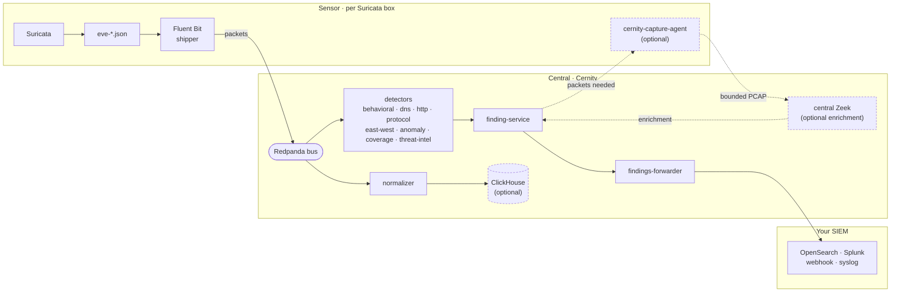

# Cernity

**Central network detection and response (NDR) analytics for Suricata sensors.**

Cernity is the middle tier of a tiered NDR architecture. Suricata inspects packets
at the edge and emits telemetry; Cernity does the heavy, stateful analysis
centrally — behavioral detection (beaconing, exfiltration, DNS tunneling, long
connections, rare destinations), protocol anomalies, lateral movement, threat-intel
matching, and optional on-demand packet forensics — and emits **security findings**
to your existing SIEM.

The governing principle:

> **Raw network telemetry is analytics input. Security findings are SIEM input.**

Cernity reimplements the stateful, Zeek/RITA-style analysis that people usually run
at the edge, and moves it to a central box with CPU and memory to spare — so the
sensor keeps inspecting packets at line rate instead of competing for resources.

> **Status:** early. The engine has run in production against live traffic and is
> being packaged into this repository. Code and deployment docs land incrementally.

## Cernity turns Suricata into a full NDR

Suricata is a world-class **IDS and edge sensor** — but on its own it isn't a full
**Network Detection and Response** platform. Its stateful facilities (flow state, flowbits,
cross-flow tracking) are edge- and rule-scoped; it isn't built for **central, cross-host,
long-window behavioral analytics**, a findings lifecycle, enrichment, or a response path.
**Cernity is the add-on that supplies those NDR capabilities.** Suricata inspects; Cernity
remembers across the fleet, analyzes, enriches, prioritizes, and delivers findings to your SIEM.

> **Maturity note:** an [independent audit](docs/cernity-independent-audit.md) verified the core
> analytics path and found real gaps (confirmed-threat finalization, per-sensor trust boundary,
> some deployment paths). See the [audit response](docs/audit-response.md) for verified-today vs.
> the v0.4 roadmap.

| NDR capability | What Suricata gives | What Cernity adds |
|---|---|---|
| **Detection breadth** (known + unknown) | signatures + protocol logging | stateful behavioral (beaconing, exfil, DNS-tunnel, scan), fingerprint rarity (JA3/JA4/JA4+), lateral-movement, nDPI-risk, IoC matching |
| **Explainable findings + evidence** | an alert | MITRE tags, entities, detection-math, enrichment (Geo/ASN/rDNS/reputation), on-demand pcap + file carving |
| **High-fidelity triggers** | a firehose of events | dedup + severity gating + prevalence + suppression → a small stream of ready-to-act findings |
| **Network forensics / retention** | ephemeral telemetry | ClickHouse retention, MinIO pcaps, correlation + host timelines |
| **Automated response + integration** | — | SOAR playbooks + pluggable SIEM adapters (Splunk/Devo/ES/syslog/webhook, fan-out) |
| **Openness & data sovereignty** | open-source sensor | broker-agnostic, `contracts/` schemas, source-available, 100% self-hosted, no phone-home |

Honest boundaries: detection is heuristic/explainable (**not** ML — a future track); the
analyst console and guided-hunting UI are your SIEM's job (Cernity is the findings engine);
DPI is tiered (edge + on-demand Zeek), by design. Full mapping and *how* each area is
covered: **[docs/ndr-coverage.md](docs/ndr-coverage.md)**.

## How it fits together

- **On the sensor:** stock Suricata + a light log shipper (Fluent Bit), plus an
  optional `cernity-capture-agent` for on-demand packet forensics. No detection
  runs on the sensor — it only produces and forwards logs.
- **Central:** a set of small single-job services on a message bus, backed by
  Redpanda, Redis, ClickHouse, and object storage. Cernity speaks the **Kafka API** —
  Redpanda is the bundled reference, but any Kafka-API broker (Apache Kafka, Confluent,
  MSK, Aiven, WarpStream) works: just point `REDPANDA_BOOTSTRAP` at it.
- **Output:** Cernity emits findings only. It does **not** ship a SIEM — it forwards
  findings to yours. OpenSearch is the documented reference; any SIEM is a config
  or adapter swap.

## What you bring

- A Suricata sensor (any deployment — containerized or bare-metal). Cernity ships a
  containerized reference sensor for evaluators, and a bind-mount mode for existing
  tuned sensors.
- A SIEM to receive findings (or use the emit-to-file / webhook adapters).

## Quickstart

> **Already run a Suricata sensor and just want Cernity added to it?** Follow the
> step-by-step **[Getting started guide](docs/getting-started.md)** — stand up Cernity,
> point your sensor at it, and wire your SIEM, top to bottom, copy-paste.

The fastest way to *see it work* first — replay a recorded C2 beacon through the whole
pipeline, no live sensor needed:

    cp cernity.env.example .env          # optional: every setting has a default
    docker compose -f deploy/quickstart/docker-compose.yml up --build

Within about a minute a beacon finding is written to the `cernity-out` volume. Read it:

    docker compose -f deploy/central/docker-compose.yml exec findings-forwarder \
      cat /out/findings.jsonl

Run just the central core (point your own Suricata sensor at it):

    docker compose -f deploy/central/docker-compose.yml up --build

All settings live in `.env` (copy from `cernity.env.example`) — bus address,
tenant, state backend, findings sink, ClickHouse, and log level. To point a real
Suricata sensor at Cernity and wire your SIEM, follow the
[Getting started guide](docs/getting-started.md).

## Deploying at scale

Three deployment paths, same architecture:

| Path | For | Where |
|---|---|---|
| **Single host** (Compose) | evaluation, small single sites | `deploy/central`, `deploy/quickstart` |
| **Manual multi-server** (Compose, no orchestration) | your own hardware, static scaling | [`deploy/scale/`](deploy/scale/README.md) · [placement guide](docs/placement.md) |
| **Kubernetes** (Helm) | dynamic scaling / large fleets | `deploy/helm/cernity` |

The detectors are stateless consumer-group workers sharing state in Redis, so all
three scale the same way: **more replicas across more hosts, bounded by topic
partitions**. For ~1,000 sensors / ~10 Gbps of edge inspection, cluster the bus,
state, and storage, partition the high-volume topics heavily, and scale each
detector to its load — see `deploy/scale/README.md` for the sizing guide.

## The name

**Cernity** — pronounced **SUR-ni-tee** (/ˈsɜːr.nɪ.ti/; soft *c*, the cadence of
*serenity*).

It comes from the Latin **_cernere_** — "to sift, separate, distinguish, **discern**" —
the same root that gives English *discern* and *concern*. That is exactly what an NDR does:
sift a flood of network telemetry and discern the real threats from the noise. Cernity is,
literally, *the act of discerning* — the layer that separates signal from a firehose of
packets and hands you what matters.

(The name was chosen to be short, distinctive, and trademark-clear — a clean coinage rather
than a repurposed dictionary word.)

## Coming soon

Cernity is early and moving fast. Near-term: closing MITRE detection gaps (discovery,
credential-access, ransomware, lateral-exec), deeper enrichment, and bus hardening. On the
radar: a **machine-learning behavioral track** (to complement the explainable heuristics),
**threat-intel platform** integration (MISP/OpenCTI), and new detectors that light up as
**Suricata 9** (richer email/SMTP/LDAP/FTP telemetry) and **Zeek 9** (extensible flow tuples,
Redis analyzer) land upstream. The full forward view — including what's deliberately *not*
planned — is in the **[roadmap](docs/roadmap.md)**.

## License — source-available, not open source

Cernity is licensed under the **[PolyForm Perimeter License 1.0.1](LICENSE)**.

In plain terms: you can do anything with Cernity — run it, modify it, self-host it,
redistribute it — except provide to others a product that competes with Cernity.
This is a source-available (Fair Source) license, not an OSI-approved open-source
license. The distinction is deliberate: it keeps Cernity free for every operator to
use however they want, while preventing a vendor from reselling it as their own
product.

- Run it on your own network, at any scale, for any purpose
- Modify it, fork it, build on it
- Redistribute it (with the license and required notice)
- Not permitted: selling or hosting it to others as a competing product or service

**Scope:** this license covers **only the Cernity Project's own original code** —
the Cernity services, detectors, contracts, shared libraries, and docs. It does
**not** cover the independent third-party software Cernity uses, bundles, or depends
on (Suricata, Zeek, Fluent Bit, Redpanda, Redis, ClickHouse, MinIO, OpenSearch,
Python libraries), each of which is governed by its own license. See
[THIRD-PARTY-NOTICES.md](THIRD-PARTY-NOTICES.md).

"Cernity" is a trademark of the Cernity Project — see [TRADEMARK.md](TRADEMARK.md).
Contributions are covered by [CONTRIBUTING.md](CONTRIBUTING.md).

## Documentation

- [**Getting started**](docs/getting-started.md) — add Cernity to your Suricata sensor + wire your SIEM, step by step
- [**Executive summary**](docs/executive-summary.md) — what Cernity is, the problem it solves, and how, in one read
- [**How Cernity works**](docs/how-it-works.md) — the whole system in plain language, every piece explained
- [How Cernity completes Suricata into an NDR](docs/ndr-coverage.md) — each NDR capability area and how it's covered
- [Suricata vs Zeek logging parity](docs/suricata-zeek-parity.md) — how Suricata EVE covers what Zeek logs, and the honest gaps
- [Benchmark](benchmarks/README.md) — reproducible Suricata→SIEM vs Suricata→Cernity→SIEM comparison (accuracy + noise), honest both-sides
- [Roadmap](docs/roadmap.md) — what's coming: detection breadth, tracking Suricata 9 / Zeek 9, integrations, and what's deliberately *not* planned
- [ML behavioral detection (SLIPS)](docs/ml-detection.md) — the opt-in ML layer and how ML×heuristic agreement surfaces
- [Configuring Suricata for Cernity](docs/suricata-config.md)
- [Deploying the sensor bundle](docs/deploy-sensor.md)
- [SIEM integrations](docs/siem-integrations.md) — Elasticsearch/OpenSearch, Splunk, Devo, syslog/CEF, webhook (+ fan-out)
- [Logging & health](docs/logging.md) — JSON/text logs, levels, heartbeat, metrics/health endpoints
- [Finding enrichment](docs/enrichment.md) — GeoIP/ASN, community ID, reverse DNS, domain age/NRD, fingerprint naming, reputation (sign-ups + keys)
- [Development guide](docs/development.md) — build, test, and extend Cernity
- [Contributing](CONTRIBUTING.md) · [Security policy](SECURITY.md)
